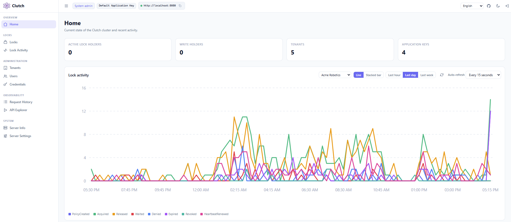
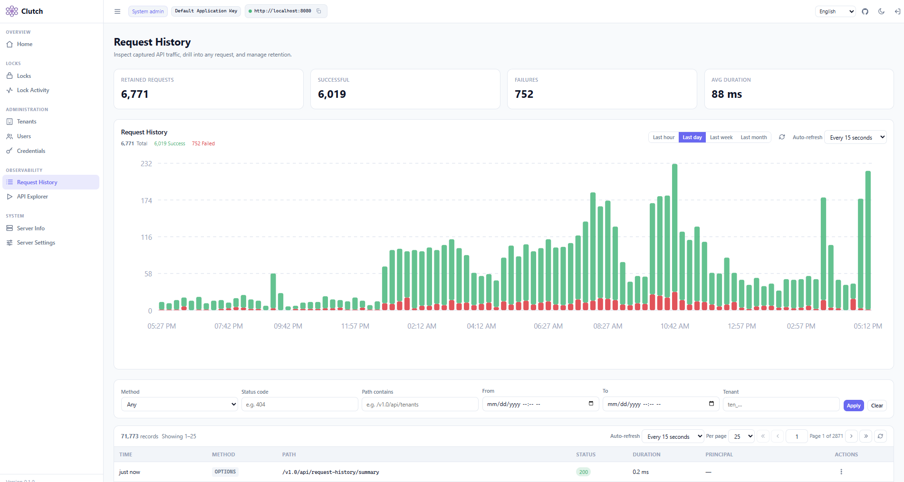
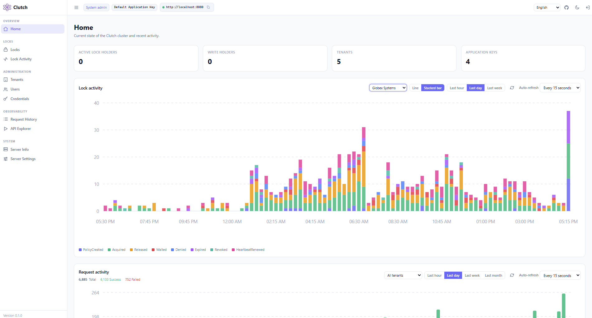
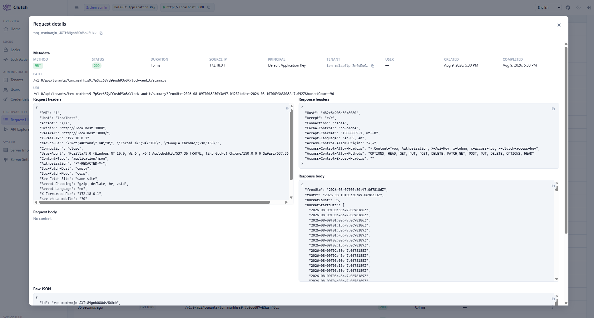

<p align="center">
  
</p>

# Clutch

> ⚠️ **Alpha (v0.2.0).** This is an early alpha release. Everything — the REST API, the WebSocket protocol, the database schema, settings, SDK surfaces, and runtime behavior — is subject to change without notice. It is not yet recommended for production use.

Clutch is a distributed lock management platform for coordinating access to shared resources across many nodes. A client acquires a **read** (non-mutating), **write** (mutating), or **delete** lock on a named key, and Clutch decides — safely, and consistently across every node in the fleet — whether that client may proceed.

You bring the database. Clutch runs on **PostgreSQL, MySQL, SQL Server, or SQLite** — point it at a database you already operate, tell it what to name its tables, and decide whether it may create them. The database you choose is the single source of truth for every lock decision: each acquire and release runs as one transaction serialized per key, so two nodes can never hand out conflicting locks. Server memory holds only observational and bookkeeping state — who is waiting, which locks a connection holds, a cache for the dashboard — never the grant decision itself. Safety over cleverness.

## What it does

- **Bring your own database.** One provider-neutral engine, four backends. PostgreSQL, MySQL, and SQL Server back multi-node clusters; SQLite backs single-node, development, and embedded deployments. Clutch owns the column layout — narrow rows are what keep the lock path fast — but the table names, an optional schema, and whether Clutch creates the tables at all are yours to set.
- **Three lock modes.** Read locks are shared, write locks are exclusive among writers, and delete locks are fully exclusive and drain everything. The first client to acquire a given key fixes its policy — how many concurrent readers are allowed, whether a write blocks reads, and the lease lifespan — and every later client is held to it.
- **Two acquisition behaviors.** Fail fast when the lock is unavailable, or wait for it up to a caller-supplied timeout. A blocked waiter retries on a bounded poll interval and is granted the moment the key frees; correctness never depends on a push notification arriving.
- **Safe ownership.** A lock is owned by the WebSocket session that holds it; closing the socket releases it. Every hold also carries a TTL lease renewed by heartbeat, so a crashed or half-open client's locks expire on their own. Each grant returns a monotonic fencing token so a downstream resource can reject a stale holder.
- **Multi-tenant administration.** Tenants isolate lock namespaces, users, and application keys. Users are system administrators, tenant administrators, or regular members. A React dashboard — localized in English, German, and Japanese — shows live locks, audit history, a lock-activity chart, and a database configuration editor; a REST API, an MCP server, and a Postman collection cover the same surface.

<details>
<summary><strong>Screenshots</strong></summary>

<p align="center">
  
</p>
<p align="center">
  
</p>
<p align="center">
  
</p>
<p align="center">
  
</p>

</details>

## Architecture

Clients connect over WebSockets with a tenant application key and drive locks through a persistent connection. Administration and observability run over a versioned REST API with OpenAPI metadata. Multiple stateless server nodes sit behind an nginx load balancer and share one database; scaling out is a matter of adding nodes. Telemetry follows the [Radiant](https://github.com/jchristn) OpenTelemetry model, exposing metrics for both the web transport and the lock data path, scraped by Prometheus and rendered in preconfigured Grafana dashboards.

```
clients ──ws──▶  nginx ──▶ [ node1 | node2 ] ──▶ your database (the lock authority)
dashboard ─rest─▶          │
                           └── /metrics ─▶ Prometheus ─▶ Grafana
```

Every node is stateless and interchangeable; the database is the only shared state, and it decides every grant. Cross-node coordination is deliberately simple: a blocked waiter re-runs its acquire transaction on a bounded poll interval (default one second, configurable, and shortened to fit the caller's remaining timeout). Clutch does not use a database push channel — no `LISTEN/NOTIFY`, no Service Broker — so the same coordination code path runs identically on all four providers. A waiter's wakeup latency is bounded by the poll interval; a grant's correctness is bounded by nothing but the transaction itself.

## Schema design and throughput

The tables on the lock decision path are deliberately narrow. The lock-definitions and lock-holders tables hold only fixed-width columns — a 64-character id, a handful of integers and a `bigint` fencing counter, booleans, an enum stored as a short tag, and timestamps. There is no wide JSON, no free-form blob, and no large text on these rows. A holder row is on the order of a couple hundred bytes, which means the database packs many of them into each page.

Small rows are what make the hot path fast. The active working set — the definitions and current holders for the keys under contention — fits in a small number of pages, so it stays resident in the database's buffer cache and the OS page cache instead of forcing disk reads. An acquire serializes concurrent attempts on a key by locking exactly one narrow definition row and touching its unique `(tenantid, lockkey)` index entry; the transaction reads and writes a handful of small tuples and commits. How that row lock is taken is the one thing that differs by engine: `SELECT … FOR UPDATE` on PostgreSQL and MySQL, an `UPDLOCK, ROWLOCK, HOLDLOCK` range lock on SQL Server, and an `IMMEDIATE` transaction on SQLite. A transient deadlock or serialization failure — which InnoDB and SQL Server will occasionally raise under contention — is retried automatically rather than surfaced to the caller.

The wide data lives elsewhere on purpose. The request-history table (captured headers and bodies) and the lock-audit table (the append-only event trail) carry the larger text and JSON columns, and they sit off the decision path. The lock engine never pages those rows in to grant a lock, so audit volume and captured request bodies cannot slow down acquisition.

## Bring your own database

Clutch is configured for a database through the `Database` block of its settings (editable in the dashboard's Server Settings, or in `clutch.json`, or via environment variables). At minimum you choose a provider and how to reach it:

- **PostgreSQL / MySQL / SQL Server** — set `Host`, `Port`, `DatabaseName`, `Username`, and `Password`. These back multi-node clusters.
- **SQLite** — set `FilePath`. SQLite is single-node only; running more than one node against a shared SQLite file is not supported, and Clutch warns at startup when SQLite is selected.

By default Clutch creates its tables the first time it starts, using idempotent, version-tracked migrations, and it names them `clutch_tenants`, `clutch_lock_holders`, and so on — the `clutch_` prefix keeps them from colliding with tables already living in a database you own. You can change any of that:

- **Table names.** Override the name Clutch uses for any of its nine purposes, add a global prefix, or set a schema/namespace (honored on PostgreSQL and SQL Server). Every name is validated against a strict identifier allowlist.
- **Schema management.** Leave `ManageSchema` on and Clutch keeps its own schema up to date. Turn it off for a least-privilege deployment: Clutch then issues no DDL, verifies at startup that every configured table exists, and refuses to start with a clear error if one is missing. A reviewable `sql/{provider}/schema.sql` ships for each provider so a DBA can create the tables by hand.

Before you save a configuration you can validate it — the dashboard's "Test connection" button (and the `POST /v1.0/api/settings/database/test` endpoint behind it) opens a connection with the supplied settings and reports success or the exact failure.

A minimal SQL Server example, naming two tables and pinning a schema:

```json
"Database": {
  "Type": "SqlServer",
  "Host": "sql.internal",
  "Port": 1433,
  "DatabaseName": "coordination",
  "Username": "clutch_app",
  "Password": "…",
  "Schema": "clutch",
  "ManageSchema": true,
  "Tables": {
    "LockHolders": "app_lock_holders",
    "LockAudit": "app_lock_audit"
  }
}
```

## Getting started

The reference deployment is Docker: two server nodes behind nginx, sharing one PostgreSQL database, with Prometheus and Grafana.

```bash
cd docker
docker compose up -d
```

That stack is the canonical example of Clutch clustered — two interchangeable nodes coordinating through one shared database. To run against MySQL or SQL Server instead, keep the same two-node-behind-nginx shape and change only the backing service and the nodes' `CLUTCH_DB_*` environment. To run against SQLite, run a single node with a file volume.

See [`BYOD.md`](BYOD.md) for the full build-out plan, [`REST_API.md`](REST_API.md) and [`WEBSOCKETS_API.md`](WEBSOCKETS_API.md) for the protocols, [`DOCKER.md`](DOCKER.md) for the deployment details, and the `sdk/` directory for C#, JavaScript, and Python clients.

## Scope notes

Clutch deliberately narrows one thing from the reference architecture it is built against:

- **No RBAC.** Authorization is the three-tier model — system admin, tenant admin, regular user — without roles and permissions.

The database provider is no longer a limitation. Removing the PostgreSQL-specific `LISTEN/NOTIFY` coordination path in favor of polling is what let the same engine run unchanged on all four backends.

## License

MIT. See [`LICENSE.md`](LICENSE.md).
